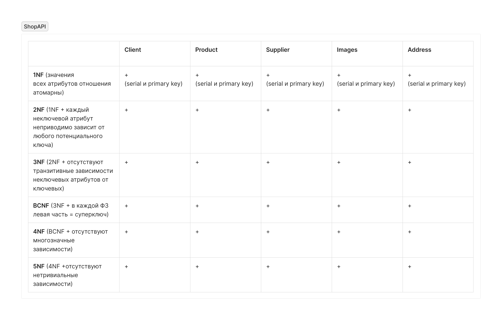

### Суть проекта
- Реализация REST API, который позволит взаимодействовать с базой данных клиентов магазина бытовой техники. Этот API будет:
1. Реализовывать основные CRUD операции (Create, Read, Update, Delete) для сущности "Клиент".
2. Иметь валидацию входящих данных (на этапе создания и обновления клиента).
3. Правильно обрабатывать ошибки (400, 404) и возвращать соответствующие коды и сообщения.
4. Поддерживать пагинацию при получении списка клиентов.
5. Использовать DTO для передачи данных между слоями приложения.
6. Использовать мапперы для преобразования моделей из слоя БД в DTO и обратно.
7. Использовать паттерн Repository для доступа к данным БД.
8. Иметь спецификацию OpenAPI для документации API, доступную через Swagger UI.
9. Иметь RESTful API с корректными методами и путями.

## Этап 1: Настройка окружения и проекта
### Настройка окружения
- Создание проекта (Maven).
- Подключение необходимых зависимостей (PostgreSQL драйвер, JSON библиотека, библиотека для маппинга).
- Настройка Swagger.

### Нормализация БД
1. Проектируем БД
 
 *Первоначальная БД*
2. Проверяем на соответствие нормальным формам
 
 *Соответствие НФ*
3. Реализуем БД в PostgreSQL
 
 *Схема базы данных*

## Этап 2: Определение моделей данных
### Реализация моделей
- Создание классов для сущностей (Entity).
- Добавление аннотаций JPA: @Entity, @Table(name = "clients"), @Id, @GeneratedValue(strategy = GenerationType.IDENTITY), @Column (для всех полей). 
- Использование Lombok @Data, чтобы сократить код. 
- Определение всех полей сущности (id, firstName, lastName, email, phone).

### Реализация DTO
- Создание классов для передачи данных (DTO-классов) в пакете dto:
  * ClientDto (для чтения)
  * ClientCreateDto (для создания)
  * ClientUpdateDto (для обновления)
  * ClientPatchDto (для частичного обновления)
  * Добавление Lombok @Data.
  * Определение полей для каждого DTO, добавление аннотации валидации (@NotBlank, @Size, @Email и т.д.).

## Этап 3: Реализация доступа к данным
### Реализация DAL
- Создание интерфейсов и классов для доступа к данным (Repository).
- Реализация взаимодействия с БД (JDBC).
- Создание интерфейса ClientRepository в пакете repository.
    *   Наследование от JpaRepository<Client, Long>.
    *   Добавление методов для поиска:
        *   findByFirstNameAndLastName(String firstName, String lastName) (для поиска по имени и фамилии).
    *   Остальные методы CRUD (save, findById, deleteById, findAll) будут автоматически сгенерированы Spring Data JPA.

## Этап 4: Реализация маппинга
### Реализация маппинга
- Создание классов для конвертации между Entity и DTO.
- Создайте интерфейс ClientMapper в пакете mapper.

### Используйте MapStruct или добавьте реализацию вручную
- Объявите методы для преобразования:
  - ClientDto toClientDto(Client client)
  - Client toClient(ClientCreateDto clientCreateDto)
  - Client toClient(ClientUpdateDto clientUpdateDto)
  - void updateClientFromDto(ClientPatchDto clientPatchDto, @MappingTarget Client client)

### Реализация Mapper (Если не используете MapStruct)
  - Создайте класс реализующий интерфейс ClientMapper.
  - Реализуйте все методы преобразования вручную.

## Этап 5: Реализация бизнес-логики
### Реализация Service Layer
- Создание классов для бизнес-логики. 
- Создайте класс ClientService в пакете service. 
- Добавьте аннотацию @Service. 
- Внедрите ClientRepository и ClientMapper через конструктор или @Autowired. 
- Реализуйте методы для обработки запросов:
  - createClient(ClientCreateDto clientCreateDto)
  - getClientById(Long id)
  - getAllClients(int limit, int offset)
  - getClientsByFirstNameAndLastName(String firstName, String lastName)
  - updateClient(Long id, ClientUpdateDto clientUpdateDto)
  - patchClient(Long id, ClientPatchDto clientPatchDto)
  - deleteClientById(Long id)
- Используйте маппер для преобразования данных.
- Обрабатывайте ошибки (бросайте исключения для ненайденных элементов).
- Добавьте @Transactional на уровне класса или методов для управления транзакциями.

## Этап 6: Реализация REST API
### Создание контроллеров
- Создание классов для обработки HTTP-запросов и ответов (сервлеты или аналогичный механизм). 
- Реализация валидации данных. 
- Генерация Swagger документации. 
- Создайте класс ClientController в пакете controller.
- Добавьте аннотации @RestController и @RequestMapping("/api/v1/clients").
- Внедрите ClientService.
  - Реализуйте методы для обработки запросов:
  - POST /: для создания клиента (используйте @RequestBody,  @Valid).
  - GET /{id}: для получения клиента по ID (используйте @PathVariable).
  - GET /: для получения всех клиентов с пагинацией (используйте @RequestParam для limit и offset).
  - GET /search: для получения клиентов по имени и фамилии (@RequestParam firstName и lastName).
  - PUT /{id}: для обновления клиента (используйте @PathVariable и @RequestBody,  @Valid).
  - PATCH /{id}: для частичного обновления (используйте @PathVariable и @RequestBody, @Valid).
  - DELETE /{id}: для удаления клиента (используйте @PathVariable).
- Используйте DTO для передачи данных.
- Обрабатывайте исключения, используя @ExceptionHandler для возврата корректных HTTP кодов ошибок.

### Валидация
- Используйте аннотацию @Valid для валидации запросов DTO.

### Обработка ошибок
- Реализация обработки исключений.

## Этап 7: Настройка и тестирование
### Запуск
- Настройка сервера (например, Tomcat)

### Настройка Swagger
- Настройте springdoc в application.properties или application.yml (путь к Swagger UI).
- Добавьте аннотации Swagger к контроллерам для описания API.

### Тестирование
- Запустите приложение.
- Откройте Swagger UI в браузере (http://localhost:{YourPort}/swagger/index.html).
- Используйте Swagger UI для проверки работы всех API.
- Используйте Postman или Curl для более детального тестирования.
- Напишите Unit-тесты для тестирования Service-слоя.

## Дополнительные улучшения
- Убедитесь, что API соответствует RESTful принципам. 
- Обработайте все возможные ошибки корректно (400, 404 и т.д.). 
- Реализуйте все требование в начале. 
- Рефакторинг кода.